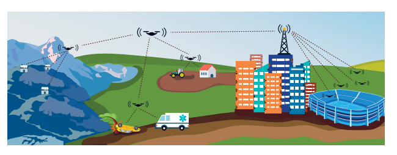

# Survey: Aerial Base Stations and Their Placement in Future Cellular Networks

## Author: Tuna Temiz

Due to the ever-expending usage of unmanned aerial vehicles, between terrestrial and aerial terminals a
highly reliable and ever-present connection is required. This in turn serves as a way of controlling such devices safely and allows them to be used to exchange data between terminals. The equipment of unmanned aerial vehicles can function as a collection of services provided to the users on the ground through the use of a wireless infrastructure or it can be a user equipment of aerial nature, functioning in conjunction with terrestrial users, depending on its usage. To give an example, for the purposes of surveillance and broadcasting and any streaming service that functions in real time, the usage of aerial user equipment and aerial base stations can be considered in ordered provide greater capacity, efficiency of energy and coverage where wireless networks are involved. Solutions that include unmanned aerial base stations prove to be both faster and easier to use in terms of deployment time and accessibility to certain areas compared to their non-aerial counterparts respectively, and mobility is an obvious benefit in all of the aforementioned cases. That being said, such an approach comes with its own set of challenges of both an academic and technical nature, and in order to ensure their wide usage, these challenges have to be addressed properly. For those purposes, this paper aims to serve as both a survey study and literature search with the aim of giving an overview of the use of unmanned aerial vehicles, their main scenarios of usage, certain research areas that include their optimal placement and the optimization of their trajectory including open research issues, directions and future work in this domain. The survey shows that the work undertaken regarding aerial base stations has increased exponentially in the recent years with significant developments in the optimization of their placement and trajectory, as well as progress in overcoming energy limitations, however despite this, the domain can be considered in its infancy as there are still many obstacles to be overcome if it is to have widespread use one day. 

